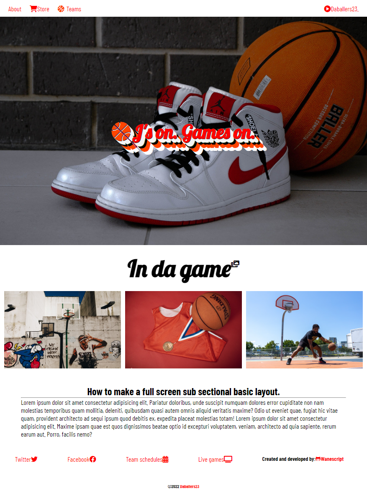

## **___
Location: United States
___**

---

### 👋🏿🏽Wad up,  I'm wanescript

## **<h2 align="center">Artist, and fullstack javascript developer.</h2>**

___
Non-traditional self-taught artist, student, and web developer. Learning everyday.
___

---

Fundamental knowledge of the following technologies :

 

---

- 🧾Open to freelance work or internship, preferably remote. Internship will be based on interest of company work and company culture.
- 🖥️ Currently learning react and react-native.
---

<h3 align="center">^_Teaching while learning_^</h3>

^^^^^^^^^^^^^^^^^^^^^^^^^^^^^^^^^^^^^^^^^^^^^^^^^^^^^

<h1 align="center">Daballers23</h1>

<h3 align="center">Project: Simple landing page layout.</h3>

___**<h3 align="center"> Click image for website.</h3>**___

 
Simple website layout using html and css grid with some basic design principals. Deployed to heroku cloud storage for world wide access. 

---
 

 

---
resources: 

[pexel](https://www.pexels.com/) for images.

[fontawesome-icons](http://fontawesome.com) for icons.

<a target="_blank" href="https://icons8.com/icon/20909/html-5">Html 5</a> icon by <a target="_blank" href="https://icons8.com">Icons8</a>

<a target="_blank" href="https://icons8.com/icon/21278/css3">CSS3</a> icon by <a target="_blank" href="https://icons8.com">Icons8</a>

<a target="_blank" href="https://icons8.com/icon/108784/javascript">JavaScript</a> icon by <a target="_blank" href="https://icons8.com">Icons8</a>

<a target="_blank" href="https://icons8.com/icon/54087/nodejs">Nodejs</a> icon by <a target="_blank" href="https://icons8.com">Icons8</a>

<a target="_blank" href="https://icons8.com/icon/cdYUlRaag9G9/docker">Docker</a> icon by <a target="_blank" href="https://icons8.com">Icons8</a>

<a target="_blank" href="https://icons8.com/icon/31085/heroku">Heroku</a> icon by <a target="_blank" href="https://icons8.com">Icons8</a>

<a target="_blank" href="https://icons8.com/icon/13631/adobe-illustrator">Adobe Illustrator</a> icon by <a target="_blank" href="https://icons8.com">Icons8</a>

<a target="_blank" href="https://icons8.com/icon/13677/adobe-photoshop">Adobe Photoshop</a> icon by <a target="_blank" href="https://icons8.com">Icons8</a>
